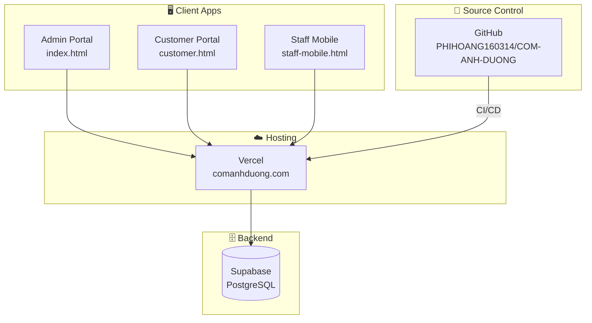
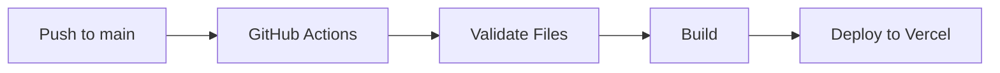

# 🏗️ Hướng Dẫn Vận Hành Hệ Thống F&B Master

## 📋 Tổng Quan Hệ Thống



---

## 🌐 Các Giao Diện

| Portal | URL | Mục đích |
|--------|-----|----------|
| **Admin** | `/index.html` | Dashboard, POS, quản lý menu, đơn hàng, nhân viên |
| **Customer** | `/customer.html` | Xem menu, đặt hàng, tích điểm |
| **Staff** | `/staff-mobile.html` | Check-in, xem đơn bếp, quản lý ca |

---

## 🗄️ Database (Supabase)

### Tables

| Table | Mô tả | RLS |
|-------|-------|-----|
| `categories` | Danh mục menu (3 cấp) | Public read |
| `menu_items` | Món ăn với giá, mô tả | Public read |
| `orders` | Đơn hàng + items (JSONB) | Insert public, read auth |
| `customers` | Thành viên + điểm tích lũy | Auth only |
| `combos` | Combo khuyến mãi | Public read |

### Kết nối
```bash
# Cấu hình trong .env
SUPABASE_URL=https://xxx.supabase.co
SUPABASE_ANON_KEY=eyJ...
```

---

## 🚀 CI/CD Pipeline



**Trigger:** Push lên `main` → Auto deploy trong ~1 phút

---

## 📁 Cấu Trúc Code

```
CAD/
├── index.html           # Admin portal
├── customer.html        # Customer portal
├── staff-mobile.html    # Staff app
├── manifest.json        # PWA config
├── sw.js               # Service worker
├── css/                # 11 stylesheets
├── js/                 # 42 modules
│   ├── app.js          # Main admin app
│   ├── customer-app.js # Customer logic
│   ├── supabase-client.js # DB connection
│   ├── data.js         # Local data fallback
│   └── ...
├── sql/schema.sql      # DB schema
└── docs/               # Documentation
```

---

## ⚙️ Modules Chính

| Module | File | Chức năng |
|--------|------|-----------|
| Core | `app.js` | Init, navigation, theme |
| POS | `pos.js` | Bán hàng, thanh toán |
| Orders | `orders.js` | Quản lý đơn |
| Kitchen | `kitchen.js` | Màn hình bếp realtime |
| Menu | `menu.js` | CRUD menu |
| Customers | `customers.js` | CRM, loyalty |
| PWA | `pwa-utils.js`, `sw.js` | Offline, install |
| i18n | `i18n.js` | Đa ngôn ngữ VI/EN |

---

## 🔧 Vận Hành Hàng Ngày

### Mở/Đóng cửa
1. **Mở cửa:** Nhân viên check-in qua Staff Portal
2. **Đóng cửa:** Xem thống kê ngày → Xuất báo cáo

### Theo dõi đơn
- **Bếp:** Màn hình Kitchen hiển thị realtime
- **Phục vụ:** POS để tạo đơn + thu tiền

### Backup
- Supabase tự động backup hàng ngày
- Code backup trên GitHub

---

## 🆘 Xử Lý Sự Cố

| Sự cố | Giải pháp |
|-------|-----------|
| Không load data | Kiểm tra Supabase status → Dùng local fallback |
| PWA không cài | HTTPS required → Check cert on Vercel |
| Deploy fail | Xem GitHub Actions logs |
| Config mới | Edit `.env` → Push → Auto redeploy |

---

## 📞 Thông Tin Liên Hệ

- **Production:** https://comanhduong.com
- **GitHub:** https://github.com/PHIHOANG160314/COM-ANH-DUONG
- **Supabase:** Dashboard trong project settings
- **Hotline:** 0917 076 061

---

*Cập nhật: 31/12/2024*
