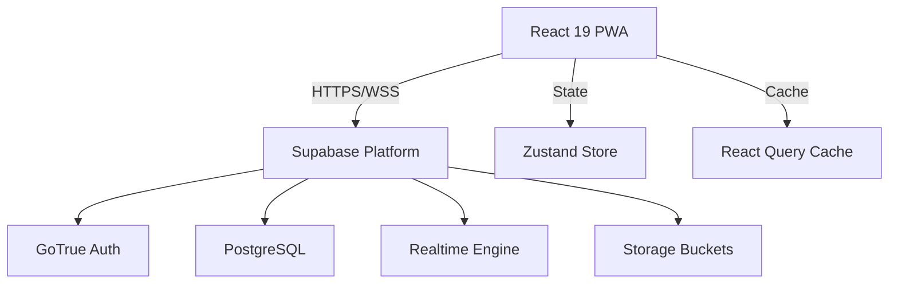

# System Architecture

## 🏗 High-Level Architecture

## 🔄 Data Flow
1. **Fetch**: Components request data via custom hooks using `React Query`.
2. **Cache**: Data is cached/deduplicated by `React Query`.
3. **Mutate**: Optimistic updates applied immediately; bg sync to Supabase.
4. **Real-time**: Subscriptions listen for DB changes (`INSERT`/`UPDATE`) to auto-refresh cache.

## 🔌 API Integration Patterns
- **Client**: `@supabase/supabase-js` v2.
- **Typed RPC**: Database types generated from schema for full end-to-end type safety.
- **Row Level Security (RLS)**: Security logic lives in the database, not the client.

## ⚡ Real-time Architecture
- **Channels**:
  - `orders`: Global channel for KDS and Admin.
  - `orders:user_id`: Private channel for customer updates.
  - `delivery`: Channel for shipper coordination.
- **Events**: `INSERT` (New Order), `UPDATE` (Status Change).

## 📱 Offline-First Strategy
- **Service Worker**: Caches static assets and app shell (via `vite-plugin-pwa`).
- **Persist Query**: `persistQueryClient` saves critical data (Menu, User Profile) to localStorage.
- **Queue**: Offline mutations queued and replayed when online (future enhancement).

## 🛡 Security Architecture
- **Authentication**: JWT via Supabase Auth.
- **Authorization**: RLS policies enforce data access (e.g., Users can only see their own orders).
- **Input Validation**: Zod schemas validate all forms and API inputs.

## 🛡 Resilience Patterns
- **Graceful Fallback**:
  - **Menu/Categories**: Automatically switches to embedded demo data if Supabase connection fails (e.g., Auth 401, Network Error).
  - **Config Checks**: Verifies Supabase configuration before attempting connection to prevent crashes in unconfigured environments.
