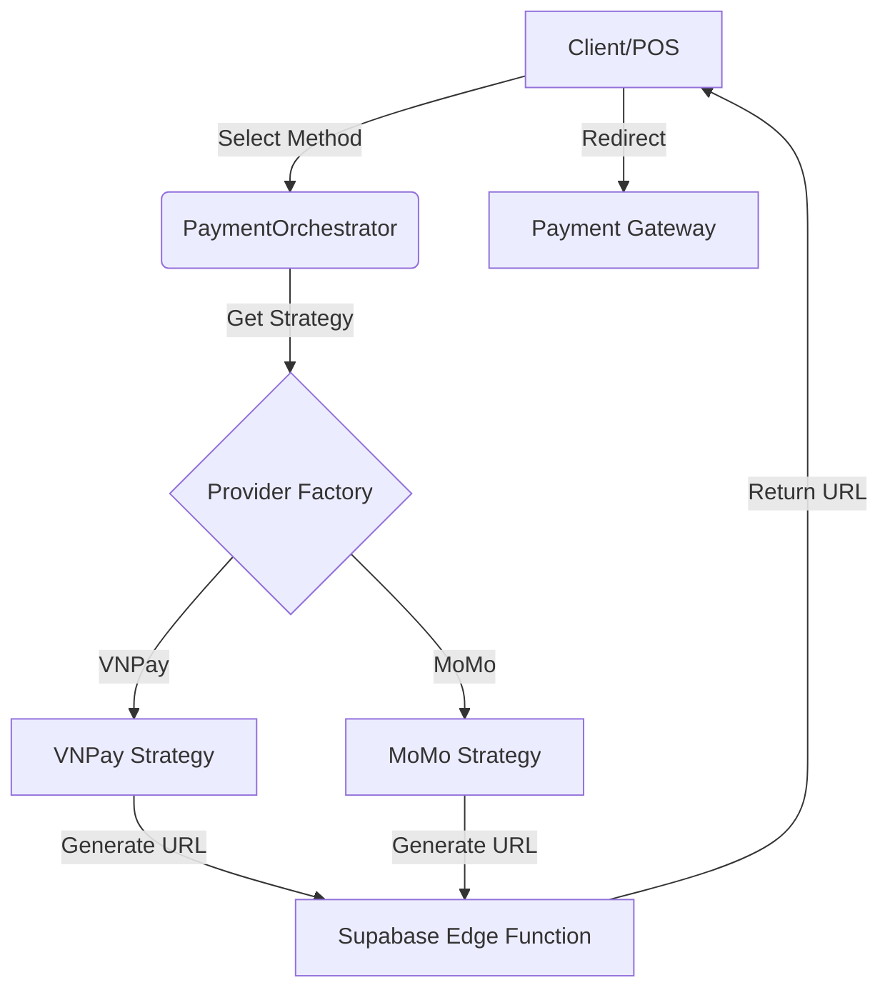

# Payment Gateway Integration Architecture Report (2026)

**Date:** 2026-01-31
**Context:** Multi-gateway (VNPay, MoMo), React + Supabase, Restaurant POS.

## 1. Architecture Patterns
Adopt a **Strategy Pattern** to decouple payment logic from the core order system.



### Abstraction Layer (TypeScript Interface)
```typescript
interface PaymentStrategy {
  createPaymentUrl(order: Order, ipAddr: string): Promise<string>;
  verifyWebhookSignature(payload: any, signature: string): boolean;
  parseWebhookData(payload: any): PaymentResult;
}
```

## 2. Backend Architecture (Supabase)

### Database Schema
Separate `orders` from `payment_transactions` for 1:N relationship (retries/partial payments).

```sql
CREATE TABLE payment_transactions (
    id UUID PRIMARY KEY DEFAULT uuid_generate_v4(),
    order_id UUID REFERENCES orders(id),
    provider VARCHAR(20) NOT NULL, -- 'vnpay', 'momo'
    provider_txn_id VARCHAR(100),
    amount INTEGER NOT NULL,
    status VARCHAR(20) DEFAULT 'pending', -- pending, success, failed
    request_payload JSONB, -- Audit
    response_payload JSONB, -- Audit
    created_at TIMESTAMPTZ DEFAULT NOW()
);
CREATE INDEX idx_txn_order ON payment_transactions(order_id);
```

### Edge Functions
Use localized Edge Functions (deploy to Singapore/Vietnam region if available) for low latency.

1.  **`create-payment`**: Authenticated. Validates order, selects strategy, returns redirect URL.
2.  **`handle-webhook`**: Public. Handles IPN from gateways.
    *   **Idempotency**: Check `payment_transactions` by `provider_txn_id`. If exists & processed, return 200 immediately.

## 3. Frontend Flow (React)

1.  **Selection**: UI card grid for "Tiền mặt", "VNPay", "MoMo".
2.  **Initiation**: Call `create-payment`. Store `txn_id` in local storage.
3.  **Redirect**: `window.location.href = response.paymentUrl`.
4.  **Return Handling**:
    *   Route `/checkout/result?status=...`
    *   **Do not trust URL params.** Call RPC `verify_order_status(order_id)` to check DB.
5.  **Polling (Optional)**: For QR dynamic display on POS, poll transaction status every 3s.

## 4. Security Architecture

*   **Secrets**: Store `VNP_HASH_SECRET`, `MOMO_SECRET_KEY` in Supabase Vault / Env Vars. NEVER in frontend code.
*   **Signature Verification**:
    *   **VNPay**: HMAC-SHA512 of sorted query parameters.
    *   **MoMo**: HMAC-SHA256 of JSON body fields.
*   **Checksums**: Validate amount in webhook matches order amount in DB.

## 5. Error Handling & Reconciliation

*   **Timeouts**: If user closes browser, IPN (Webhook) is the source of truth.
*   **Reconciliation Job**: Scheduled Edge Function (pg_cron) runs nightly.
    *   Query pending transactions > 15 mins.
    *   Call Gateway "Query Status" API.
    *   Update local DB state.

## 6. Testing Strategy

1.  **Mock Strategy**: Create `MockPaymentStrategy` that returns a local success URL instantly.
2.  **Sandbox**: Use VNPay/MoMo sandbox credentials in Staging environment.
3.  **End-to-End**: Playwright tests using `request` context to simulate Webhook hits.

## Unresolved Questions
*   Does the business require specific "Refund" capabilities via API?
*   Are there split payment requirements (Part Cash + Part Card)?
